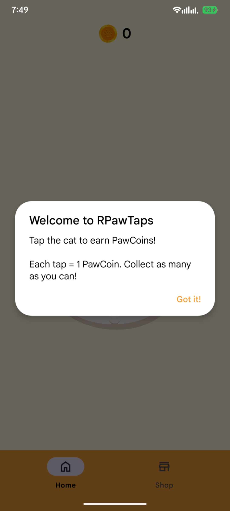
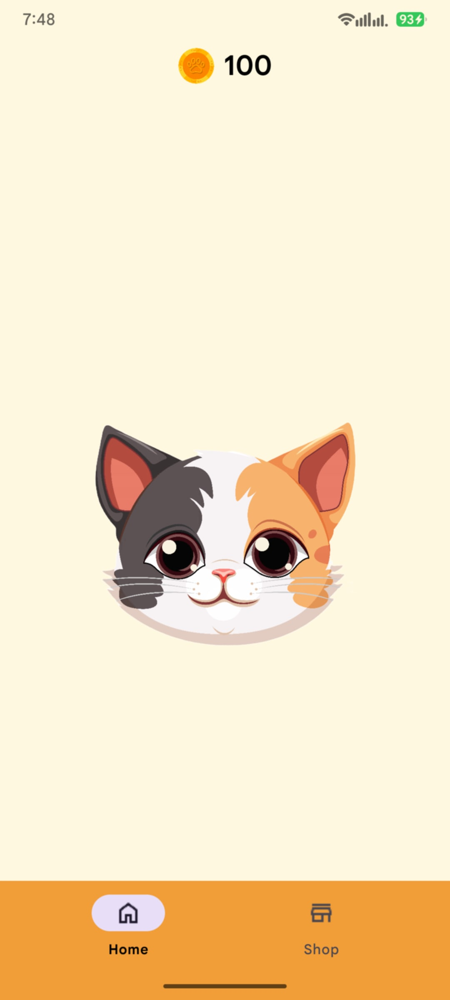
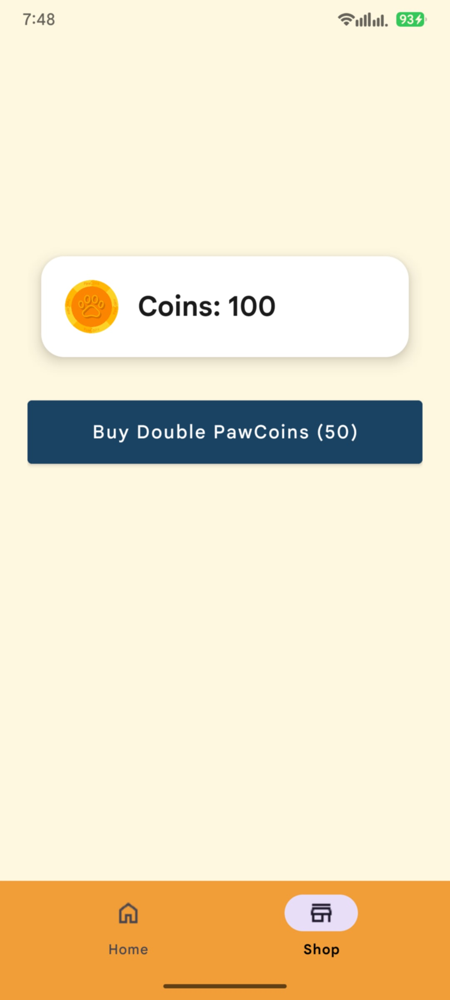

# RPawTaps

**Description:**  
RPawTaps is a fun clicker game where you tap the cat to earn coins and upgrade for more rewards.

**Developers:**  
- RigiEnriquez
- jhnstphn

---

## Features
- Tap the cat to earn coins.  
- Upgrade cats to earn more coins per tap.  
- Simple, engaging, and addictive gameplay.  

---

## How to Play
1. Open the app.  
2. Tap on the cat to collect coins.  
3. Use coins to buy upgrades and increase your earnings.  
4. Keep tapping and upgrading to earn more coins.  

---

## Screenshots


*Tutorial screen.*


*Main screen where you tap the cat to earn coins.*


*Shop screen to increase coin earnings per tap.*

---

## Installation

### Option 1: Install from APK
1. Go to the [Releases page](https://github.com/RigiEnriquez/RPawTaps/releases) on GitHub.  
2. Download the latest `RPawTaps.apk`.  
3. On your Android device, enable **Install from Unknown Sources** if prompted.  
4. Open the APK to install the app.

### Option 2: Build from Source
1. Clone the repository:  
   ```bash
   git clone https://github.com/RigiEnriquez/RPawTaps.git
2. Open the project in Android Studio.
3. Build and run the app on an emulator or Android device.
